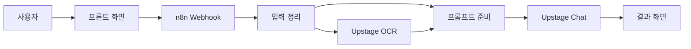

# 전체 흐름 이해하기

사용자는 웹 화면에 노트를 넣고, n8n은 그 요청을 받아 AI 도구를 호출한 뒤 결과를 다시 화면에 보냅니다.

## 왜 n8n을 쓰나요?

n8n은 코드를 많이 쓰지 않고도 여러 도구를 연결할 수 있게 해 줍니다. 이번 실습에서는 Webhook, OCR, RAG-lite, LLM 호출, 응답 정리를 하나의 흐름으로 연결합니다.
