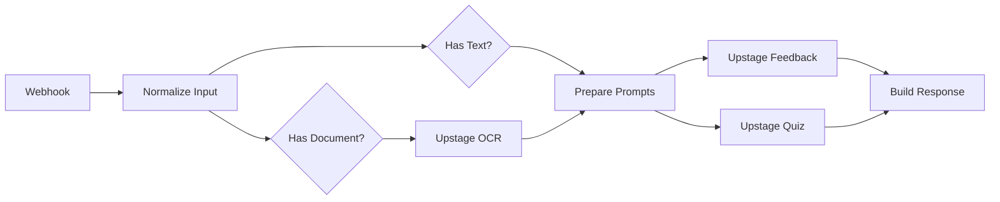

# 워크플로우 전체 흐름

n8n 워크플로우는 여러 노드가 순서대로 연결된 흐름입니다.

```mermaid
flowchart LR
    webhook["Webhook"] --> normalize["Normalize Input"]
    normalize --> hasText{"Has Text?"}
    normalize --> hasDoc{"Has Document?"}
    hasDoc --> ocr["Upstage OCR"]
    hasText --> prompts["Prepare Prompts"]
    ocr --> prompts
    prompts --> feedback["Upstage Feedback"]
    prompts --> quiz["Upstage Quiz"]
    feedback --> response["Build Response"]
    quiz --> response
```
